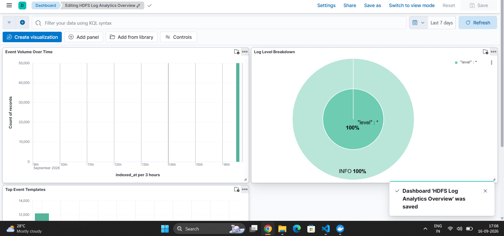
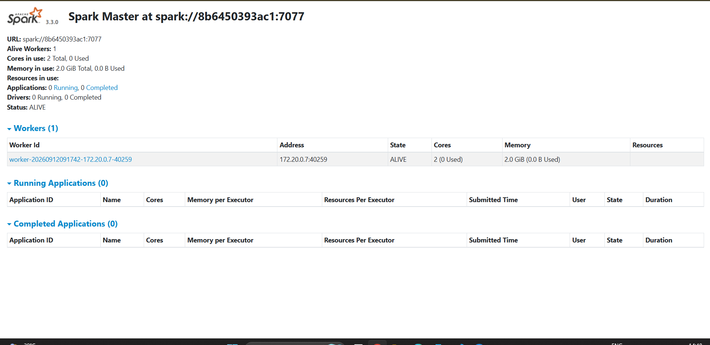
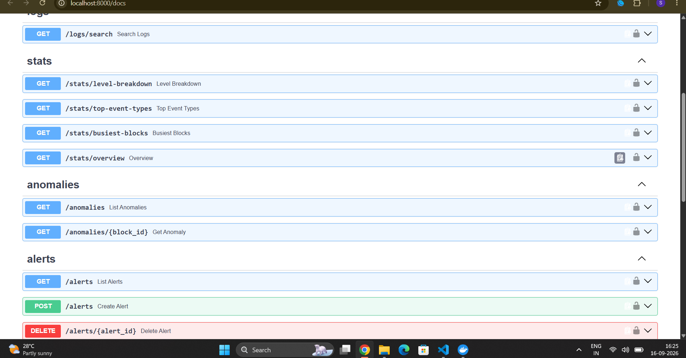
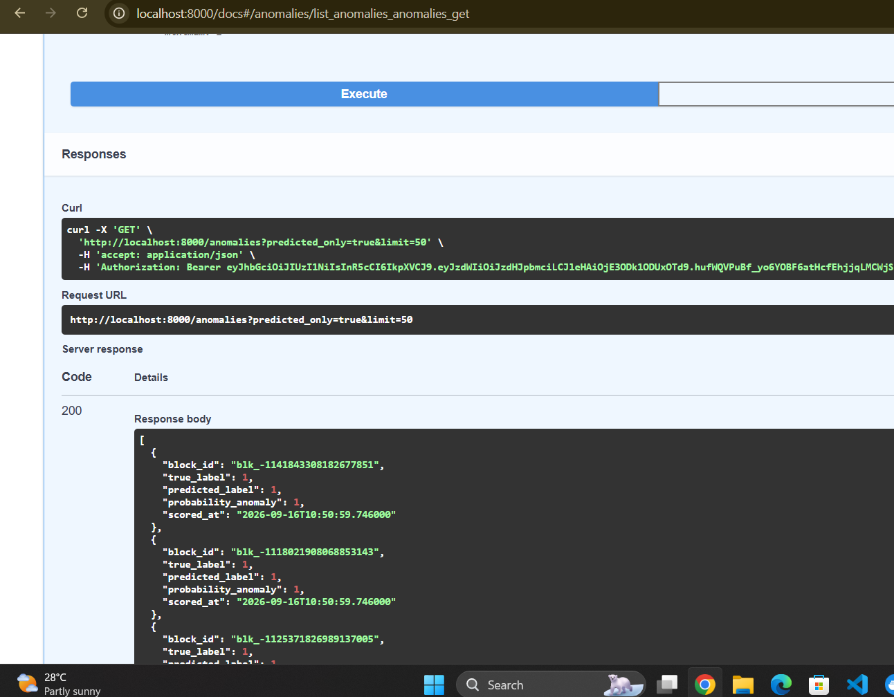

# Enterprise Log Analytics & Incident Detection Platform

A distributed, end-to-end log analytics and ML-based anomaly detection
platform built on the classic Big Data stack (Kafka, Spark, HDFS, Hive,
Elasticsearch) with a FastAPI serving layer on top.

Built as a Big Data subject project, using the [LogHub HDFS dataset](https://github.com/logpai/loghub)
(11M+ raw log lines, 575K labeled blocks) as the working dataset.

## Screenshots

| Kibana dashboard | Spark standalone cluster |
|---|---|
|  |  |

| API docs (Swagger) | ML predictions served via API |
|---|---|
|  |  |

## Architecture

```text
HDFS.log (raw logs)
      │
      ▼
 Kafka producer  ──────────────►  Kafka topic: hdfs-logs
                                          │
                        ┌─────────────────┴─────────────────┐
                        ▼                                   ▼
              Spark Structured Streaming            Elasticsearch indexer
              (parses + writes Parquet)              (parses + indexes docs)
                        │                                   │
                        ▼                                   ▼
                  HDFS: /logs/parsed                 hdfs-logs-parsed index
                        │                                   │
                        ▼                                   ▼
              Hive external table                    Kibana dashboards
              (SQL batch analytics)
                        │
                        ▼
        ML pipeline (PySpark MLlib)
   Event_occurrence_matrix.csv + anomaly_label.csv
                        │
              ┌─────────┴─────────┐
              ▼                   ▼
    Random Forest classifier   Unsupervised comparison
    (supervised, AUC 1.0)      (Isolation Forest, K-Means)
              │
              ▼
     Predictions → Postgres
              │
              ▼
        FastAPI backend  ◄──── JWT auth, /logs, /stats, /anomalies, /alerts
              │
              ▼
        React dashboard (LogWatch console)
```

Two independent consumers read the same Kafka topic (a standard fan-out
pattern): Spark handles durable storage + batch analytics, while a
lightweight Python consumer handles the fast-search path into
Elasticsearch — avoiding the need for a Spark-Elasticsearch connector.

The API deliberately doesn't talk to Spark/Hive directly. Heavy batch
work (parsing, joins, ML training) happens offline via `spark-submit`;
results land in fast, simple serving stores (Postgres, Elasticsearch)
that the API reads from. This keeps the API lightweight and is a
standard batch/serving split in real log-analytics architectures.

## Tech stack

| Layer | Technology |
|---|---|
| Ingestion | Apache Kafka, Zookeeper |
| Stream/batch processing | Apache Spark (Structured Streaming + MLlib) |
| Distributed storage | Hadoop HDFS |
| SQL analytics | Apache Hive |
| Search & dashboards | Elasticsearch, Kibana |
| ML | Spark MLlib (Random Forest), scikit-learn (Isolation Forest, K-Means) |
| Backend API | FastAPI, SQLAlchemy, JWT auth |
| App database | PostgreSQL |
| Orchestration | Docker Compose |

## Project structure

```text
enterprise-log-analytics/
├── docker-compose.yml       # full stack: Kafka, HDFS, Spark, Hive, ES, Kibana, Postgres
├── data/raw/                # dataset files (HDFS.log, templates, labels — not committed)
├── common/
│   └── log_parser.py        # shared HDFS log line parser (regex-based, 29 event templates)
├── ingestion/
│   └── kafka_producer.py    # replays HDFS.log into Kafka
├── streaming/
│   ├── spark_streaming_job.py  # Kafka → parse → HDFS Parquet
│   └── es_indexer.py           # Kafka → parse → Elasticsearch
├── batch/
│   ├── hive_ddl/create_external_tables.sql
│   ├── queries/example_aggregations.sql
│   └── spark_batch_aggregations.py
├── ml/
│   ├── feature_engineering.py   # joins occurrence matrix + true labels
│   ├── train_random_forest.py   # supervised anomaly classifier (Spark MLlib)
│   ├── unsupervised_compare.py  # Isolation Forest + K-Means comparison
│   └── score_and_export.py      # scores all blocks, writes to Postgres
├── backend/
│   ├── Dockerfile
│   └── app/
│       ├── main.py, config.py, database.py, models.py, schemas.py, auth.py
│       └── routers/          # auth, logs, stats, anomalies, alerts
├── frontend/                 # React + Vite "LogWatch" console
│   ├── Dockerfile, nginx.conf
│   └── src/
│       ├── pages/            # Overview, LogSearch, Anomalies, Alerts, Login
│       ├── components/       # Layout, ProtectedRoute
│       ├── context/          # AuthContext
│       └── services/         # api.js (Axios + JWT interceptor)
└── Screenshots/         # README images
```

## Dataset

[LogHub HDFS_v1](https://github.com/logpai/loghub/tree/master/HDFS) —
11,175,629 raw log lines from a Hadoop cluster, covering 575,061 blocks,
of which 16,838 (2.93%) are labeled anomalous. Files used:

- `HDFS.log` — raw log lines (ingested via Kafka)
- `HDFS.log_templates.csv` — 29 known event templates (hardcoded into `common/log_parser.py`)
- `Event_occurrence_matrix.csv` — precomputed per-block event counts (ML features)
- `anomaly_label.csv` — ground-truth Normal/Anomaly label per block

## Setup & phases

### Prerequisites
- Docker Desktop (with WSL2 backend on Windows)
- Python 3.11+ for local venvs (ingestion, streaming, ml, backend each have their own)
- The dataset extracted into `data/raw/`

### Phase 0 — Bring up the stack
```bash
docker compose up -d zookeeper kafka
docker compose up -d namenode datanode
docker compose up -d spark-master spark-worker
docker compose up -d hive-metastore-postgresql hive-metastore hive-server
docker compose up -d elasticsearch kibana
docker compose up -d app-postgres
```

### Phase 1 — Ingestion
```bash
cd ingestion && pip install -r requirements.txt
python kafka_producer.py --file ../data/raw/HDFS.log --limit 50000
```

### Phase 2 — Stream processing
```bash
# Spark job (inside container, resolves Docker service names)
docker exec -it spark-master /spark/bin/spark-submit \
  --master spark://spark-master:7077 \
  --packages org.apache.spark:spark-sql-kafka-0-10_2.12:3.3.0 \
  --py-files /project/common/log_parser.py \
  /project/streaming/spark_streaming_job.py

# Elasticsearch indexer (on host, separate consumer group)
cd streaming && pip install -r requirements.txt
python es_indexer.py --from-beginning
```

### Phase 3 — Batch analytics
```bash
docker exec -it hive-server hive -f /project/batch/hive_ddl/create_external_tables.sql
docker exec -it hive-server hive -f /project/batch/queries/example_aggregations.sql
```

### Phase 4 — ML anomaly detection
```bash
docker exec -it spark-master /spark/bin/spark-submit --master spark://spark-master:7077 /project/ml/feature_engineering.py
docker exec -it spark-master /spark/bin/spark-submit --master spark://spark-master:7077 /project/ml/train_random_forest.py

cd ml && pip install -r requirements.txt
python unsupervised_compare.py
```

**Results:** Random Forest achieves AUC 1.0, anomaly-class precision
0.9949, recall 0.9970. Isolation Forest (unsupervised) reaches F1 0.66;
K-Means minority-cluster heuristic reaches F1 0.32 — demonstrating the
value of labeled data on this task.

### Phase 5 — Backend API
```bash
docker exec -it spark-master /spark/bin/spark-submit \
  --master spark://spark-master:7077 \
  --packages org.postgresql:postgresql:42.6.0 \
  /project/ml/score_and_export.py

cd backend && pip install -r requirements.txt
uvicorn app.main:app --reload --port 8000
```

API docs at `http://localhost:8000/docs`. Endpoints:
- `POST /auth/register`, `POST /auth/login` — JWT auth
- `GET /logs/search` — search parsed logs (Elasticsearch)
- `GET /stats/overview`, `/stats/level-breakdown`, `/stats/top-event-types`, `/stats/busiest-blocks`
- `GET /anomalies` — ML-predicted anomalous blocks (from Postgres)
- `GET/POST/DELETE /alerts` — per-user alert configuration (CRUD)

### Phase 6 — Kibana dashboards

In Kibana (`http://localhost:5601`): Stack Management → Index Patterns
→ create one for `hdfs-logs-parsed` with `indexed_at` as the time
field. Then build 3 visualizations — a date-histogram line chart
("Event Volume Over Time"), a terms-aggregation pie chart on `level`
("Log Level Breakdown"), and a terms-aggregation bar chart on
`event_id` ("Top Event Templates") — and combine them into a saved
dashboard. See the screenshot above.

### Phase 7 — React frontend ("LogWatch" console)
```bash
cd frontend
npm install
npm run dev
```
Open `http://localhost:5173`. Dark ops-console UI: Overview (live
charts), Log Search, Anomalies (ML predictions with confidence
filtering), and Alerts (CRUD rule builder) — all behind JWT-gated
routes.

### Phase 8 — Containerize backend + frontend

Backend and frontend build as containers alongside the rest of the
stack:

```bash
docker compose up -d --build backend frontend
```

- Frontend: `http://localhost:3000`
- Backend API docs: `http://localhost:8000/docs`

The frontend's browser-side calls still hit `http://localhost:8000`
directly (that's fine — the browser runs on your host, not inside the
Docker network), while the backend's own connections to Postgres and
Elasticsearch use the `DATABASE_URL`/`ELASTICSEARCH_URL` env vars set
in `docker-compose.yml`, pointing at the internal service names
(`app-postgres`, `elasticsearch`) instead of the host-mapped ports used
during local `uvicorn`/`npm run dev` development.

To bring up the entire platform in one shot:
```bash
docker compose up -d
```

## Roadmap

- [x] Phase 0 — Environment scaffold
- [x] Phase 1 — Kafka ingestion
- [x] Phase 2 — Spark Streaming + Elasticsearch indexing
- [x] Phase 3 — Hive batch analytics
- [x] Phase 4 — ML anomaly detection (Random Forest + unsupervised comparison)
- [x] Phase 5 — FastAPI backend
- [x] Phase 6 — Kibana dashboards
- [x] Phase 7 — React frontend
- [x] Phase 8 — Containerize backend/frontend, full docker-compose demo

## Running the full stack

```bash
docker compose up -d --build
```

Wait ~60-90 seconds for HDFS to exit safe mode and for Elasticsearch/Kibana
to finish their (slow) first boot, then:

- Frontend: `http://localhost:3000`
- Backend API docs: `http://localhost:8000/docs`
- Kibana: `http://localhost:5601`
- Spark master UI: `http://localhost:8080`
- HDFS namenode UI: `http://localhost:9870`

## Notes

- `data/raw/` is gitignored — the dataset isn't committed; download from
  [LogHub](https://github.com/logpai/loghub) and place files there.
- Each Python component (`ingestion/`, `streaming/`, `ml/`, `backend/`)
  has its own `requirements.txt` and is meant to run in its own venv.
- Spark jobs run via `spark-submit` inside the `spark-master` container
  (not from the host) so they can resolve `kafka`/`namenode`/etc. by
  Docker service name.